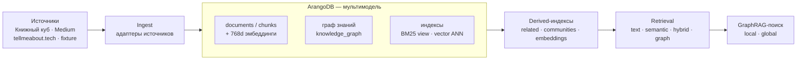
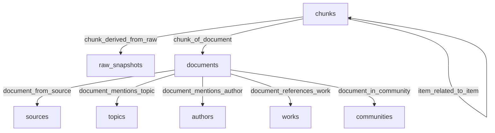

# Архитектура

Документ описывает целевую архитектуру `knowledge-base`. Это не финальная схема реализации, а рабочий контур, который помогает добавлять источники и функции без смешивания ответственности.

## Целевой поток

- **Sources** - внешние или локальные источники личных материалов: "Книжный куб", Medium, заметки, документы, архивы ссылок.
- **Ingest** - source adapters, которые получают данные из конкретного источника и сохраняют raw-снимок или читаемый экспорт.
- **Normalize** - преобразование сырого материала в единый формат: текст, метаданные, даты, ссылки, теги, цитаты.
- **Store** - долговременное хранение raw-данных, обработанных документов, индексов и generated outputs в разных зонах.
- **Index/Search** - полнотекстовый (BM25) и семантический (ANN) поиск, graph-aware hybrid-ранжирование, community detection и local/global GraphRAG-поиск поверх графа знаний (GraphRAG-эпик GR-0…GR-6 завершён — см. [graphrag-plan.md](graphrag-plan.md)).
- **Visualize/Write** - графы, карты тем, исследовательские панели и writing workflows для подготовки постов, статей и книг.

## Подсистемы

### Source adapters

Каждый адаптер отвечает только за один источник или один тип экспорта. Он должен описывать:

- вход: API, экспорт, HTML, Markdown, JSON, CSV или локальная папка;
- выход: raw-снимок и набор нормализуемых элементов;
- ограничения: rate limits, приватность, неполные метаданные, ручные шаги;
- provenance: какие поля позволяют восстановить происхождение материала.

В v1 live URL validation подтверждает public network destination, но не expected host/source authenticity; operator-selected URL доверяется для фиксированного `source_key`. Directory archives считаются trusted owner inputs и не имеют symlink/resource-isolation guarantees. Новые unattended или недоверенные source workflows требуют отдельной host allowlist, filesystem containment и size/quota policy по [ADR 0005](adr/0005-define-source-provenance-and-private-archive-boundaries.md) и [ADR 0006](adr/0006-define-the-local-security-and-privacy-trust-boundary.md).

### Storage

Хранилище должно разделять:

- `raw` - исходные данные без потери контекста;
- `processed` - нормализованные документы и метаданные;
- `generated` - производные материалы: summaries, черновики, отчеты, LLM outputs.

Это разделение важно, чтобы можно было пересобрать базу после изменения нормализации или индексации.

**Как это реализовано в v1.** ArangoDB сейчас является единой зоной хранения: raw snapshot (полный payload или manifest), нормализованные documents/chunks и derived индексы живут в одной базе. Разделение `data/raw` / `data/processed` / `data/generated` в репозитории - это соглашение для on-disk артефактов: `data/raw/` хранит исходные экспорты/снимки, которые вы передаёте адаптерам, а `data/generated/` - выходы `kb export`. `data/processed/` пока не используется (нормализованные данные живут в ArangoDB). При live-ingest по URL сырьё сохраняется только внутри базы (`raw_snapshots.payload`), поэтому для повторного ingest держите исходные снимки в `data/raw/` и передавайте их через `--input`/`--archive`. Provenance сохраняет source traceability, но v1 не фиксирует полный code/config fingerprint и не гарантирует точный historical replay; детали — в [ADR 0005](adr/0005-define-source-provenance-and-private-archive-boundaries.md).

**Модель данных (граф `knowledge_graph`).** Узлы — коллекции документов/сущностей; рёбра — типизированные связи. Similarity-рёбра `item_related_to_item` (chunk↔chunk) и членство `document_in_community` — производные (derived), перестраиваемые.

### Search and embeddings

Индекс поиска должен строиться поверх `processed`, а не напрямую поверх `raw`. Эмбеддинги и RAG-контекст должны сохранять ссылки на документы и provenance, чтобы любой найденный фрагмент можно было проверить по исходному источнику.

Первый production-like pipeline проектируется вокруг ArangoDB: documents/chunks, graph edges, ArangoSearch full-text и vector indexes живут в одном multi-model ядре. Это снижает количество движущихся частей в v1, но сохраняет явные границы storage/search/vector/graph, чтобы позже вынести отдельный движок при bottleneck.

Эмбеддинги подключаемы через `EmbeddingProvider` (`embedding.provider`): дефолт `hash` — детерминированный, offline, без зависимостей; ingest и запрос строят provider из одного конфига. Провайдер `local` даёт реальные семантические эмбеддинги через `sentence-transformers` (ставится вручную, вне locked-зависимостей). `embedding.dimension` задаёт желаемую размерность, но однородность persisted embedding space и параметры уже существующего vector index не проверяются обычным bootstrap: при смене provider/model/dimension обязателен полный `kb index rebuild --target embeddings`. Revision/fingerprint весов модели пока не хранится. Контракт и ограничения зафиксированы в [ADR 0007](adr/0007-adopt-rebuildable-embeddings-and-extractive-graphrag.md) и [GraphRAG-плане](graphrag-plan.md).

Текущий v1 fixture slice реализует этот контур через Python CLI `kb`:

- `kb platform bootstrap` создает коллекции, edge collections, ArangoSearch View, graph definition и vector index.
- `kb ingest fixture` загружает безопасный synthetic fixture и создает source/raw/document/chunk/topic/author/work records.
- `kb ingest tellmeabout-tech` загружает публичные посты из RSS/Atom или локального snapshot, создавая source/raw/document/chunk/topic/author records.
- `kb ingest medium-export` загружает локальный Medium account export directory или `.zip`, создает raw manifest snapshot и импортирует опубликованные `posts/*.html` как documents/chunks/author records.
- `kb ingest book-cube` загружает публичные посты Telegram-канала из HTML/JSON snapshot, создавая source/raw/document/chunk/topic records.
- `kb ingest book-cube-archive` загружает полный владельческий Telegram Desktop JSON archive из directory или `.zip`, создавая documents/chunks/topics и сохраняя media/file attachments только как local raw references.
- `kb index rebuild --target all` идемпотентно проверяет derived search/vector/graph слой; `--target related` отдельно строит `item_related_to_item` — взвешенные similarity-рёбра между похожими чанками из разных документов (GR-3), превращая дерево провенанса в граф знаний. Качество связей максимально с реальной моделью эмбеддингов (`embedding.provider = local`). `--target communities` кластеризует этот similarity-граф Louvain-оптимизацией модулярности (чистый Python, без зависимостей; параметр гранулярности `[community] resolution`) в узлы `communities` с экстрактивными summaries (GR-4) — основа для global-search GraphRAG.
- `kb search text`, `kb search semantic`, `kb graph neighbors`, `kb search hybrid`, `kb search local` и `kb search global` возвращают результаты с provenance; retrieval-команды поддерживают optional source filter для исследования одного источника.
  - `kb search hybrid` сливает полнотекст (BM25) и вектор и **вкладывает графовый сигнал в ранжирование**: `score_components.graph_boost` — ограниченный буст за общие сущности (GR-1) и similarity-рёбра `item_related_to_item` (GR-3b). `graph_boost = null` только если графовый слой деградировал. Если relevance-гейт оставил пустые слоты, `hybrid` дозаполняет их graph-only соседями топ-хитов (GR-3c, `graph_expanded: true`) — они дописываются после реальных хитов и не могут их перевесить.
  - `kb search local` (GR-5) собирает локальный подграф вокруг сильнейших документов запроса: связывающие сущности, similarity-соседи и сообщества. `kb search global` (GR-5) строит retrieval-conditioned обзор: сопоставляет bounded hybrid candidate pool сообществам и возвращает топ сообществ с summary и документами-цитатами; это не exhaustive проход по всем community summaries. Оба контекста экстрактивные и цитируемые (без LLM). Полный трекинг GraphRAG-подсистемы — [docs/graphrag-plan.md](graphrag-plan.md).
- `kb-mcp` открывает локальный read-only MCP server поверх тех же retrieval/document/graph/source/health операций для других проектов и агентских клиентов.
- `kb export jsonl` пишет generated exports в gitignored data zone.

### MCP integration

MCP слой является интерфейсом чтения поверх `processed`/indexed data. Он не запускает ingest, index rebuild или export, не получает raw snapshot payloads и не выдаёт локальные archive/file paths; document metadata и вложенный provenance проходят явные allowlist-проекции. Сервер работает только через локальный stdio transport. `kb_search` открывает text/semantic/hybrid и local/global GraphRAG режимы; embedding-backed запросы используют тот же configured `EmbeddingProvider` и `retrieval.min_similarity`, что CLI. Tools возвращают agent-ready snippets с `source_key`, `document_key`, `chunk_key`, URL и безопасным raw/import provenance; resources дают `kb://sources` и `kb://documents/{document_key}`. Синхронные handlers и один stdio-клиент за процесс являются принятым ограничением v1. Stdio/read-only не является per-client authorization: local OS user/process с credentials считается доверенным, а imported drafts доступны обычным read surfaces. Shared/remote concurrency или разные local identities требуют отдельного решения с auth/audit моделью; trust boundary — в [ADR 0006](adr/0006-define-the-local-security-and-privacy-trust-boundary.md).

### Visualization

Принятый, но ещё не реализованный v4 scope включает полный doc-level export в node-link JSON/GraphML и самодостаточный offline HTML с картой сообществ/тем, timeline публикаций и ego-графом документов. Вид книг/авторов отложен из-за пустого/малого текущего corpus. Визуализация не становится источником истины: артефакты пересобираются из нормализованных данных и могут раскрывать чувствительные metadata/topology даже без полного текста. Контракт — в [ADR 0008](adr/0008-adopt-offline-visualization-and-graph-export.md), статус — в [visualization-plan.md](visualization-plan.md).

### Writing assistant

Writing/research workflow использует базу знаний как контекст для письма, но отделяет черновики и generated outputs от исходных материалов. Любой фрагмент, использованный в публикации или исследовании, должен иметь ссылку на первичный источник.

### Architecture Decision Records

Architecture Decision Records живут в [docs/adr](adr/README.md). Они фиксируют значимые решения о данных, privacy, provenance, storage, search/RAG, визуализации и workflow. ADR являются docs-only артефактами и не входят в raw, processed или generated data zones.

Локальный tooling:

- `npm run adr:new` создает следующий нумерованный ADR по шаблону.
- `npm run generate:adr-index` обновляет индекс в `docs/adr/README.md`.
- `npm run check:adr` проверяет метаданные, обязательные RU/EN-секции, связи supersession и свежесть индекса.

### Spec-driven development

По умолчанию новые пользовательские фичи, контракты и source adapters проходят через GitHub Spec Kit: `.specify/` хранит upstream templates/scripts/memory, `.agents/skills/` хранит Codex skills, а `specs/` — спецификации, планы и задачи фичей. Для ограниченных сквозных remediation-, audit-, research-, architecture- и infrastructure-эпиков допустим проверяемый docs plan tracker; значимые решения в обоих workflow требуют ADR. Границы определены в [ADR 0009](adr/0009-scope-spec-kit-and-plan-tracker-workflows.md). Все эти документы являются project artifacts и не входят в data zones.

## Минимальные сущности

- **Source** - описание происхождения данных: канал, блог, локальный архив, API или экспорт.
- **Document/Item** - импортированная единица знания: пост, заметка, цитата, статья, фрагмент книги или ссылка.
- **Metadata** - дата, автор, язык, теги, URL, тип материала, статус обработки.
- **Citation/Provenance** - путь назад к источнику: origin, source URL, import timestamp, original identifier, context.
- **Topic/Tag** - тематическая разметка, добавленная вручную или автоматически.

## Принципы реализации

- Начинать с одного источника и сквозного вертикального среза.
- Предпочитать простые форматы и воспроизводимые команды до появления реальной необходимости в сложной инфраструктуре.
- Не смешивать импорт, нормализацию, индексацию и визуализацию в одном модуле.
- Сохранять возможность пересобрать processed-данные и индексы из raw-источников.
- Документировать изменения структуры данных вместе с кодом.

## Связанные документы

- [README.md](../README.md)
- [Roadmap](roadmap.md)
- [ADR decision log](adr/README.md)
- [Production Knowledge Pipeline spec](../specs/001-production-knowledge-pipeline/spec.md)
- [Tell Me About Tech Source spec](../specs/002-tellmeabout-tech-source/spec.md)
- [Book Cube Telegram Source spec](../specs/003-book-cube-telegram-source/spec.md)
- [Book Cube Owner Archive Import spec](../specs/004-book-cube-owner-archive-import/spec.md)
- [Medium Export Source spec](../specs/005-medium-export-source/spec.md)
- [Knowledge Base MCP Server spec](../specs/006-knowledge-base-mcp-server/spec.md)
