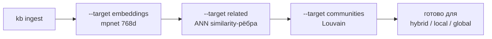
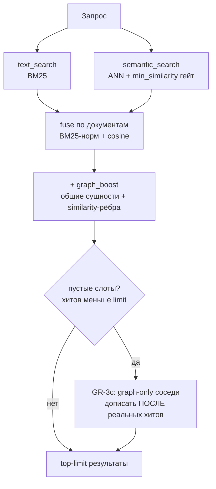
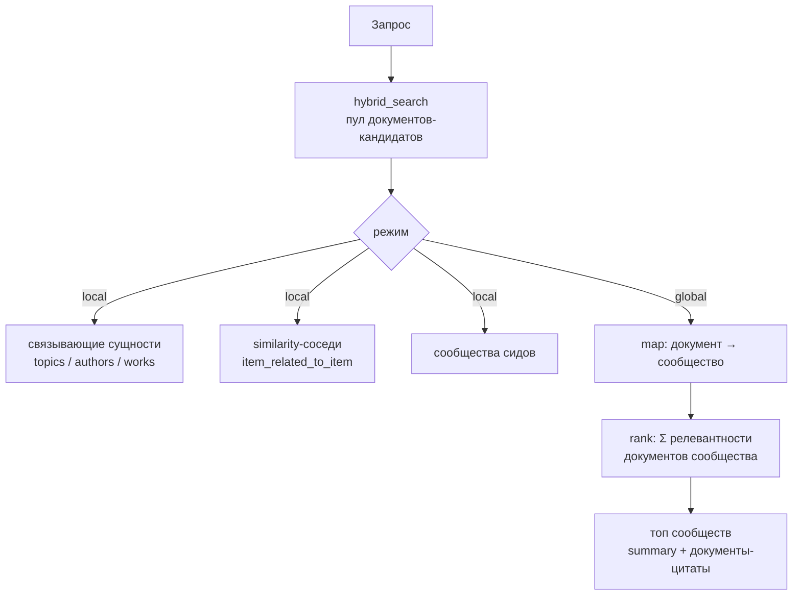

# GraphRAG: план реализации

**Проект:** `knowledge-base` — персональный конвейер знаний на ArangoDB
**Дата:** 8 июля 2026
**Контекст:** мультиагентный анализ реализации GraphRAG (граф-модель, ingest, retrieval, embeddings, доки) с состязательной верификацией ключевых утверждений против кода.

## Статус: GraphRAG-эпик завершён ✅ (11 июля 2026)

Все шаги **GR-0 … GR-6** плюс ранее отложенный **GR-3c** смерджены в `main` (PR #22–#33). Разрывы из исходной оценки закрыты:

| Исходный разрыв | Статус |
|---|---|
| граф не участвует в ранжировании | ✅ `graph_boost` (GR-1/GR-3b) + расширение кандидатов графом (GR-3c) |
| нет графа знаний (`item_related_to_item` пуст) | ✅ similarity-рёбра пишутся (GR-3): 102 556 рёбер на реальном корпусе |
| эмбеддинги несемантичны (hash, dim 8) | ✅ `all-mpnet-base-v2` (768d) на 24 877 чанках (GR-2/GR-2b) |
| нет community detection и summaries | ✅ Louvain + экстрактивные summaries (GR-4): 11 сообществ |
| нет local/global GraphRAG-поиска | ✅ `kb search local` / `global` (GR-5) |
| доки не отражают ограничения | ✅ `architecture.md` актуализирован |

Дальше — раздел «[Как работает база знаний сейчас](#как-работает-база-знаний-сейчас)». Ниже сохранена **исходная** оценка (стартовая точка эпика) для истории.

## Как работает база знаний сейчас

Полный путь: **ingest → хранилище → derived-индексы → retrieval → GraphRAG-поиск.**

### 1. Хранилище (ArangoDB, мультимодель)
Одна база совмещает три модели поиска:
- **Документы/чанки** — коллекции `documents`, `chunks` (текст + 768-мерный эмбеддинг на чанк).
- **Граф знаний** — именованный граф `knowledge_graph`: рёбра провенанса (`document_from_source`, `chunk_of_document`, `chunk_derived_from_raw`), сущности (`document_mentions_topic/author`, `document_references_work`), similarity-рёбра (`item_related_to_item`) и членство в сообществах (`document_in_community`).
- **Индексы поиска** — ArangoSearch view `kb_text_view` (BM25, полнотекст, единая гранулярность по чанкам после GR-6) + vector index `idx_chunks_embedding_vector` (cosine, ANN).

### 2. Ingest (адаптеры источников)
`kb ingest <source>` — `book-cube` (Telegram «Книжный куб»), `medium-export`, `tellmeabout-tech`, `fixture`. Поток: источник → сырой снапшот (`raw_snapshots`, дедуп по sha256) → документы с каноническим id → чанки с эмбеддингом → рёбра провенанса и сущностей. Провенанс сквозной: любой результат прослеживается до snapshot / import-run / источника.

### 3. Эмбеддинги (pluggable)
`EmbeddingProvider`: `hash` (детерминированный, dim 8, дефолт, zero-dependency) либо `local` (sentence-transformers, `all-mpnet-base-v2`, 768d). Выбирается конфигом (`[embedding] provider/model/dimension`). `kb index rebuild --target embeddings` переэмбеддит корпус **без re-ingest**: дропает и пересоздаёт vector index под новую размерность и чистит устаревшие similarity-рёбра. Обычный bootstrap не сверяет параметры уже существующего index, а revision/fingerprint весов модели не хранится, поэтому смена space требует полного явного rebuild и pinned/cached model artifact (см. [ADR 0007](adr/0007-adopt-rebuildable-embeddings-and-extractive-graphrag.md)). **Текущий рабочий корпус: 2 972 документа / 24 877 чанков на mpnet-768d.**

### 4. Derived-индексы (`kb index rebuild --target …`)
- `all` — идемпотентно проверяет search/vector/graph слой (не запускает дорогие mutating targets `embeddings`/`related`/`communities`).
- `related` — строит `item_related_to_item` через ANN: каждый чанк → топ-K похожих чанков из других документов, вес = cosine ≥ порога. **102 556 рёбер.**
- `communities` — Louvain-кластеризация similarity-графа (чистый Python, параметр `[community] resolution`) → узлы `communities` с экстрактивными summaries. **11 тематических сообществ** (architecture / AI-ML / management-books / eng-process).
- `embeddings` — переэмбеддинг (см. выше).

Порядок сборки derived-слоя на реальном корпусе:

### 5. Retrieval (`kb search …`)
- `text` — BM25 по view.
- `semantic` — ANN по vector index; relevance-гейт `min_similarity` отсекает слабые хиты (recall precision, GR-3d).
- `hybrid` — сливает BM25 + вектор и **вкладывает графовый сигнал в ранжирование**: `score_components.graph_boost` — ограниченный буст за общие сущности (GR-1) и similarity-рёбра (GR-3b). Если гейт оставил пустые слоты — дозаполняет их graph-only соседями топ-хитов (GR-3c, `graph_expanded: true`), которые дописываются после реальных хитов и не могут их перевесить.
- `graph neighbors` — прямой обход графа знаний от топика/автора/работы/документа/чанка.

Конвейер `hybrid` (граф-осведомлённое ранжирование + расширение кандидатов):

### 6. GraphRAG-поиск (поверх графа и сообществ)
- `kb search local` — локальный подграф вокруг сильнейших документов запроса: связывающие сущности (topics/authors/works) + similarity-соседи + сообщества сидов.
- `kb search global` — retrieval-conditioned обзор: сопоставляет bounded hybrid candidate pool сообществам, ранжирует их по суммарной релевантности попавших документов без size normalization и возвращает топ с summary/`top_topics` и документами-цитатами; это не exhaustive проход по всем summaries корпуса.

Контекст обоих — **экстрактивный и цитируемый** (без LLM-генерации), совместим с обычным форматом результатов (провенанс на каждой строке).

### Сквозные инварианты
- **Zero runtime dependency** — ядро на stdlib (свой ArangoDB HTTP-клиент, argparse-CLI); sentence-transformers опционален (lazy import), Louvain — чистый Python.
- **Провенанс сквозной** — каждый результат прослеживается до источника (raw snapshot / import run / url / captured_at).
- **Идемпотентность** — derived-индексы полностью перестраиваемы; повторный ingest дедуплицирует, `created_at` неизменен.
- **Гейт качества** — `ruff` + `ruff format` + `mypy` + `pytest` (unit + live-ArangoDB integration, изолированная тест-БД); CI (lint/test) + SonarCloud на каждом PR.

## Итоговая оценка (исходная — стартовая точка, июль 2026)

Сейчас в проекте есть **субстрат** для GraphRAG (граф + вектор + полнотекст в одной ArangoDB), но не сам GraphRAG. Ключевые разрывы:

- **граф не участвует в ранжировании** — единственный запрос, который реально ходит по графу, это изолированная команда `kb graph neighbors`; ранжированный `hybrid` сливает только BM25 + вектор, вклад графа (`graph_boost`) жёстко `None`;
- **нет графа знаний** — `topic/author/work` это теги из метаданных источника, а не извлечённые сущности; типизированное ребро связей `item_related_to_item` объявлено, но нигде не пишется;
- **эмбеддинги несемантичны** — `hash_embedding` (детерминированный хеш, dim=8) не ловит смысл;
- **нет community detection и community summaries** — то есть ни одного канонического строительного блока GraphRAG (Microsoft-style local/global search);
- **доки не отражают текущее ограничение** — `architecture.md` перечисляет `kb graph neighbors` и `kb search hybrid` без оговорки, что граф пока не влияет на ранжирование; roadmap уже честно относит «расширенный GraphRAG» в v3.

Это ожидаемо для ранней стадии: roadmap изначально помещает GraphRAG в v3. План ниже — маршрут от субстрата к работающему GraphRAG, разбитый на отдельные PR.

## Что уже сделано (аудит реализации)

Аудит реализации полностью отработан и смерджен в `main` (все 46 находок, см. [implementation-audit-plan.md](implementation-audit-plan.md)). GraphRAG-релевантная часть (шаг 3 «Качество retrieval») подтверждена в текущем коде:

- **#15** graph_boost как подстрочный матч → исправлено: `graph_boost` теперь `None` ([retrieval.py](../src/knowledge_base/retrieval.py)), а не фейковый лексический сигнал;
- **#13** дубликаты в `graph_neighbors` → исправлено: `OPTIONS { uniqueVertices: "global", uniqueEdges: "path" }` ([retrieval.py](../src/knowledge_base/retrieval.py));
- **#12** vector index не используется → исправлено: `APPROX_NEAR_COSINE` вызывается ([retrieval.py](../src/knowledge_base/retrieval.py)), полный скан остался только как fallback при `--source`/ошибке индекса;
- **#16** фьюжн вычитает отрицательный косинус → исправлено: косинус клампится `max(0, vector)` и BM25 min-max-нормируется ([retrieval.py](../src/knowledge_base/retrieval.py));
- **#14** двойная индексация `documents.text` + `chunks.text` во view → смягчено на уровне выдачи (`text_search` дедуплицирует по `document_key` через `COLLECT`, [retrieval.py](../src/knowledge_base/retrieval.py)); во view индексируются обе гранулярности до сих пор.

## Приоритетный план

Каждый шаг оформляется **отдельным PR** против `main`. Шаги упорядочены по зависимостям и влиянию. Номера `GR-N` стабильны и используются в PR-описаниях и коммитах для трассируемости; они не пересекаются с номерами `#N` из аудита.

| Шаг | Ветка / PR | Проблемы | Зависит от | Статус |
|----:|------------|----------|-----------|--------|
| GR-0 | `docs/graphrag-plan` | GR-6 (доки) | — | ✅ merged ([#22](https://github.com/polomodov/knowledge-base/pull/22)) |
| GR-1 | `feat/graph-aware-hybrid` | GR-1 | GR-0 | ✅ merged ([#23](https://github.com/polomodov/knowledge-base/pull/23)) |
| GR-2 | `feat/pluggable-embeddings` | GR-2 | — | ✅ merged ([#24](https://github.com/polomodov/knowledge-base/pull/24)) |
| GR-2b | `feat/reembed-switch-provider` | switch provider без re-ingest | GR-2 | ✅ merged ([#30](https://github.com/polomodov/knowledge-base/pull/30)) |
| GR-3 | `feat/related-edges` | GR-3 | GR-2 | ✅ merged ([#25](https://github.com/polomodov/knowledge-base/pull/25)) |
| GR-3b | `feat/related-in-ranking` | GR-3 (ранжирование) | GR-3 | ✅ merged ([#26](https://github.com/polomodov/knowledge-base/pull/26)) |
| GR-3d | `feat/relevance-gated-recall` | recall precision | GR-2 | ✅ merged ([#27](https://github.com/polomodov/knowledge-base/pull/27)) |
| GR-3c | `feat/graph-candidate-expansion` | GR-3 (recall) | GR-3d + GR-2b (реальные эмбеддинги) | ✅ merged ([#33](https://github.com/polomodov/knowledge-base/pull/33)) |
| — | `chore/isolate-integration-test-db` | тест-БД изоляция | — | ✅ merged ([#28](https://github.com/polomodov/knowledge-base/pull/28)) |
| GR-6 | `chore/retrieval-view-granularity` | GR-7 (аудит #14) | — | ✅ merged ([#29](https://github.com/polomodov/knowledge-base/pull/29)) |
| GR-4 | `feat/graph-communities` | GR-4 | GR-3 | ✅ merged ([#31](https://github.com/polomodov/knowledge-base/pull/31)) |
| GR-5 | `feat/graphrag-search` | GR-5 | GR-3, GR-4 | ✅ merged ([#32](https://github.com/polomodov/knowledge-base/pull/32)) |

### GR-0 — Документация плана

**Ветка / PR:** `docs/graphrag-plan`
**Проблемы:** GR-6
**Задача:** Зафиксировать этот план; сослаться на него из roadmap v3; добавить в `architecture.md` честную оговорку, что `kb graph neighbors` — отдельная команда, а граф пока не влияет на ранжирование `hybrid` (полный GraphRAG — v3). Статусы аудита не трогаем — он уже полностью отработан на `main`.
**Критерии приёмки:** roadmap v3 ссылается на `docs/graphrag-plan.md`; `architecture.md` явно отмечает, что граф не участвует в ранжировании; ни одно утверждение доков не противоречит коду.

| # | Важность | Файл:строка | Проблема | Решение |
|--:|----------|-------------|----------|---------|
| GR-6 | низкий | `docs/architecture.md:56` | `architecture.md` перечисляет `kb graph neighbors` и `kb search hybrid` без оговорки, что граф не влияет на ранжирование (можно прочитать как «GraphRAG готов») | Добавить оговорку + ссылку на этот план; roadmap уже корректен. |

### GR-1 — Граф-осведомлённый hybrid (реальный graph_boost)

**Ветка / PR:** `feat/graph-aware-hybrid`
**Проблемы:** GR-1
**Задача:** Ввести реальный вклад графа в ранжирование `hybrid_search`: после слияния BM25+вектор подмешивать в скор каждого извлечённого кандидата буст за связность — общие `topic`/`author`/`work` с сильными кандидатами (в перспективе — рёбра `item_related_to_item` из GR-3). Заполнить `score_components.graph_boost` реальным числом вместо `None` и включить его в итоговый скор.
**Критерии приёмки:** документ, связанный в графе с сильными кандидатами запроса, получает измеримый и объяснимый буст; `score_components.graph_boost` не `None` и задокументирован; буст ограничен и не перевешивает лексический/семантический сигнал; unit-тесты на функцию буста (чистая логика) и интеграционный тест ранжирования на фикстуре. Это самый дешёвый конкретный шаг к «graph-aware» поиску — работает уже на текущем графе тегов/провенанса, до GR-3.

**Реализация (принято):** seed-множество — top-`5` кандидатов по слитому (text+vector) скору. Для кандидата `raw_boost = Σ по другим seed (base_seed × |общие topic/author/work|)` — общие сущности берутся из рёбер `document_mentions_topic/author` и `document_references_work` (документ + его чанки) одним AQL. `raw_boost` min-max-нормируется в `[0, 0.5]` и прибавляется к скору; кандидат без общих сущностей получает ровно `0`. При недоступности графа `graph_boost` остаётся `None`, а в `degraded_components` добавляется `graph` (порядок откатывается к text+vector). Функция буста (`_graph_boosts`) — чистая и покрыта unit-тестами; end-to-end проверка — интеграционным тестом на живой ArangoDB.

**Скоуп-решение (по ревью Codex, PR #23):** GR-1 переранжирует и бустит **уже извлечённый пул** (text ∪ vector), но НЕ подтягивает graph-only соседей, у которых не было ни лексического, ни векторного хита. Полноценное расширение кандидатов обходом `1..2 ANY` перенесено в **GR-3/GR-5**, потому что: (1) `semantic_search` и так заполняет `limit` слотов по сырому косинусу — «пустых слотов» под расширение почти нет, и кандидат с base=0 маргинален; (2) на текущем графе тегов расширение по общему массовому топику (напр. «books») низкоточное и добавит шум; ценность появляется только с реальными типизированными рёбрами сущностей (GR-3) и relevance-гейтом. Таким образом GR-1 остаётся узким и хорошо покрытым, а расширение реализуется там, где оно точное.

| # | Важность | Файл:строка | Проблема | Решение |
|--:|----------|-------------|----------|---------|
| GR-1 | высокий | `src/knowledge_base/retrieval.py:463`, `src/knowledge_base/retrieval.py:533` | `hybrid_search` сливает только BM25+вектор; `graph_boost=None`; граф доступен только через изолированную `kb graph neighbors` | Расширять top-k обходом графа, считать буст за связность, включить в итоговый скор. |

### GR-2 — Подключаемые эмбеддинги

**Ветка / PR:** `feat/pluggable-embeddings`
**Проблемы:** GR-2
**Задача:** Абстрагировать провайдер эмбеддингов за интерфейсом. `hash_embedding` остаётся дефолтом offline/тестов; добавить опциональный реальный семантический провайдер (локальная модель или API), выбираемый через конфиг, за optional-extra — чтобы не нарушать инвариант «ноль обязательных рантайм-зависимостей». Провести единый источник размерности от `settings` до vector index (закрывает и аудит #7/#33, если ещё открыты).
**Критерии приёмки (уточнены по фактической реализации):** провайдер выбирается конфигом; дефолт остаётся локальным и детерминированным; local provider отклоняет несовпадение native/configured dimension; explicit `--target embeddings` пересоздаёт vector index; ordinary bootstrap не инспектирует параметры существующего index, что зафиксировано как ограничение ADR 0007; синонимы сближаются на реальном провайдере.

**Реализация (принято):** интерфейс `EmbeddingProvider` (`model`/`dimension`/`embed`) в `embeddings.py`; `build_embedding_provider(settings)` (кэш) выбирает провайдера по `[embedding].provider`. Дефолт — `HashEmbeddingProvider` (offline, детерминизм, тесты). Провайдер `local` — реальная `sentence-transformers` модель с ленивым импортом. Ingest (`ingest_core`, `fixture`) и retrieval (`semantic_search`/`hybrid_search` через CLI) используют один configured provider. Однородность persisted space — операционный инвариант полного `--target embeddings`: `local` валидирует native dimension против settings, но обычный bootstrap не инспектирует params существующего vector index, а model revision/fingerprint не хранится.

**Скоуп-решение (dependency invariant):** `sentence-transformers` НЕ объявлен как optional-extra в `pyproject`, потому что он тянет torch + CUDA/nvidia (56 пакетов, +1000 строк в `uv.lock`), что ломает выдержанный инвариант «ноль рантайм-зависимостей». Вместо этого — ленивый импорт + понятная ошибка с инструкцией `uv pip install sentence-transformers`. `uv.lock` остаётся чистым; дефолтный (hash) путь и CI не тянут ничего. Если позже решим формализовать extra — это отдельный осознанный шаг.

| # | Важность | Файл:строка | Проблема | Решение |
|--:|----------|-------------|----------|---------|
| GR-2 | высокий | `src/knowledge_base/embeddings.py:13` | `hash_embedding` (детерминированный хеш, dim=8) несемантичен — «semantic search» не про смысл | Интерфейс провайдера, опциональная реальная модель, единая размерность. |

### GR-2b — Re-embed / переключение провайдера

**Ветка / PR:** `feat/reembed-switch-provider`
**Проблема:** GR-2 добавил провайдера, но эмбеддинги считаются только на ingest — переключить провайдера/модель без полного реингеста было нельзя (а другой размерности мешает зафиксированный vector index).
**Задача:** дать шаг `kb index rebuild --target embeddings` (`build_embeddings`): пересчитать вектор каждого чанка текущим провайдером и перестроить vector index под его размерность.
**Реализация (принято):** дропнуть старый vector index (его размерность неизменна) → пересчитать эмбеддинги чанков батчами (`_reembed_chunks`, обновляя `embedding` + `embedding_model`) → создать vector index на `provider.dimension`. Отдельный target, НЕ входит в `all`. `ArangoClient.drop_index` добавлен. Интеграционный тест: реальная смена размерности 8 → 16.
**Зачем:** это операционная предпосылка, чтобы **реально включить `provider = local`** на существующем корпусе и получить осмысленные `item_related_to_item`/GR-3c/GR-4 (без повторения тупика GR-3c на шумном hash).

### GR-3 — Извлечение сущностей и связей (граф знаний)

**Ветка / PR:** `feat/related-edges`
**Проблемы:** GR-3
**Задача:** Превратить дерево провенанса в граф знаний — заполнить объявленное, но пустое `item_related_to_item` взвешенными similarity-рёбрами из эмбеддингов (GR-2), связывающими похожие чанки из РАЗНЫХ документов.
**Критерии приёмки:** `item_related_to_item` реально заполняется; рёбра несут вес/метод; построение идемпотентно; связи участвуют в graph-обходе (`kb graph neighbors` подтягивает связанные документы); unit-тесты на чистую логику отбора, интеграционный — на непустой граф связей и обход.

**Реализация (принято):** отдельный index-шаг `kb index rebuild --target related` → `build_related_edges`. Для каждого чанка берётся top-`RELATED_TOP_K` соседей с косинусом ≥ `RELATED_MIN_SCORE` из ДРУГИХ документов и той же строки `embedding_model`. Проверка не сравнивает vector length/revision, поэтому перед шагом обязателен полный однородный `--target embeddings`; mixed state неподдержан. Рёбра неориентированные (один на пару, детерминированный ключ), с `weight` и `method="embedding-similarity"`; замена идемпотентна. **Масштабирование (важно, реальный корпус ~25k чанков):** полный проход использует ANN-индекс (`APPROX_NEAR_COSINE`) — не O(N²); candidate set на ANN boundary/ties не гарантирован bit-for-bit. Есть scoped-режим `source_key` (прямое сравнение внутри одного источника; им пользуется интеграционный тест). Чистое ядро отбора (`_select_related`, `_scored_candidates`) покрыто unit-тестами; `_cosine` вынесен в `embeddings.cosine_similarity`. **`--target related` НЕ входит в `all`** — операция ANN-тяжёлая, запускается осознанно.

**Скоуп-решение (split):** этот PR строит рёбра и выставляет их в обходе графа. Интеграция связей в **ранжирование** (`graph_boost` учитывает `item_related_to_item`) и **расширение кандидатов** `hybrid` (graph-only соседи, перенос из GR-1) вынесены в отдельный **GR-3b** (`feat/related-in-ranking`), чтобы этот PR остался обозримым. Качество similarity-рёбер максимально с реальной моделью эмбеддингов (GR-2 `local`); на дефолтном hash (dim 8) они шумнее.
**Открытое решение (позже):** LLM-извлечение именованных сущностей/типизированных связей — богаче, но нужен провайдер и приватность; за конфигом, отдельным шагом.

| # | Важность | Файл:строка | Проблема | Решение |
|--:|----------|-------------|----------|---------|
| GR-3 | высокий | `src/knowledge_base/sources/ingest_core.py`, `src/knowledge_base/schema.py:145` | `topic/author/work` — теги из источника, не извлечённые сущности; `item_related_to_item` объявлен, но не пишется → нет inter-entity связей | Извлекать сущности/связи на ingest, заполнять взвешенные рёбра. |

### GR-3b — Связи в ранжировании (`graph_boost`)

**Ветка / PR:** `feat/related-in-ranking`
**Проблемы:** GR-3 (ранжирование)
**Задача:** Задействовать рёбра `item_related_to_item` (GR-3) в `graph_boost` (`hybrid`): документ, напрямую связанный similarity-ребром с сильным кандидатом (seed), получает буст — так же, как за общий topic/author/work.
**Критерии приёмки:** документ, связанный `item_related_to_item` с сильным кандидатом, получает буст; изолированный (без связи и общих сущностей) — `0`; unit- и интеграционный тесты.

**Реализация (принято):** `_document_related` резолвит chunk↔chunk рёбра до уровня документов (макс. вес на связанный документ). `_graph_boosts` теперь суммирует два сигнала связности с seed'ами: `seed_score × |общие сущности|` (GR-1) и `seed_score × similarity_weight` (GR-3b), затем min-max в `[0, 0.5]`. `_cosine`/сигнатуры не тронуты; чистая логика покрыта unit-тестами, end-to-end — интеграционным (буст только за related-ребро, без топиков). Расширение кандидатов вынесено в **GR-3c**, чтобы PR остался обозримым.

### GR-3d — Relevance-gated recall (precision)

**Ветка / PR:** `feat/relevance-gated-recall`
**Проблемы:** semantic recall паддит пул слабыми хитами
**Задача:** `semantic_search` возвращал ровно top-`limit` по сырому косинусу, включая почти-нерелевантные. Ввести настраиваемый порог релевантности (`retrieval.min_similarity`, env `KB_RETRIEVAL_MIN_SIMILARITY`, per-query `--min-similarity`): хит семантики ниже порога отбрасывается (текстовые хиты не трогаются — приходят из `text_search`).
**Критерии приёмки:** дефолт `0.0` отбрасывает только анти-коррелированные (косинус < 0) — безопасно, не режет recall; выше порог = точнее пул (осмысленно с реальной моделью, GR-2 `local`); чистая функция гейта покрыта unit-тестами, поведение — интеграционным; конфиг задокументирован.

**Зачем сейчас:** это самостоятельное улучшение precision И структурная предпосылка для GR-3c (без гейта пул всегда полон сырых косинус-хитов, и capped-расширению негде появиться).

### GR-3c — Расширение кандидатов графом (recall) ✅

**Ветка / PR:** `feat/graph-candidate-expansion`
**Проблемы:** GR-3 (recall), перенос из GR-1
**Задача:** Подтягивать в `hybrid` graph-only соседей — документы, связанные `item_related_to_item` с seed'ами, у которых не было text/vector хита.

**История (был отложен):** первая реализация + мультиагентное adversarial-ревью показали, что фича не готова к тому окружению. Были подтверждены две HIGH-проблемы у «стреляющей» (uncapped) версии — утечка через `source_key` и нарушение инварианта «не перевешивать реальный хит»; корректная (capped) версия была **инертна**: без relevance-гейта `semantic_search` всегда заполнял пул сырыми косинус-хитами > 0.5, «пустых слотов» под расширение не было, и его нельзя было детерминированно протестировать. Ценность появлялась только поверх (1) реальных эмбеддингов (GR-2 `local`) и (2) relevance-gated recall (GR-3d) — оба сделаны, поэтому фича возобновлена.

**Реализация (✅):**
- **Только пустые слоты:** расширение срабатывает лишь когда relevance-гейт оставил `len(fused) < limit`. Graph-only кандидаты (соседи топ-`_HYBRID_SEED_COUNT` хитов по `item_related_to_item`, которых нет в пуле) **дописываются после всех реальных хитов** — поэтому capped-кандидат структурно не может перевесить реальный.
- **Инвариант ранжирования + монотонность:** скор graph-only = вес связи, обрезанный по `min(_GRAPH_BOOST_CAP, скор слабейшего реального хита)`, так что итоговый список остаётся монотонно невозрастающим (существующий контракт hybrid) и реальные хиты всегда выше.
- **Source scope:** расширение уважает `source_key` (переиспользует `_related_documents` GR-5 с параметром `exclude` = весь пул); кросс-source соседи не протекают.
- **Provenance:** graph-only строки несут полный provenance-объект и помечены `graph_expanded: true`.
- **Тесты:** unit на `_graph_only_row` (обрезка скора, флаг); интеграционный на реальном ArangoDB (сосед без lexical/semantic хита входит в top-`limit`, реальный хит первый, монотонность, source-scope исключает кросс-source соседа, provenance non-null, при `limit=1` расширения нет).

**Критерии приёмки:** ✅ связанный документ без lexical/semantic хита входит в top-`limit`; ✅ capped-скор не перевешивает реальные хиты; ✅ expansion уважает `source_key`; ✅ provenance non-null; ✅ тесты.

### GR-4 — Сообщества графа и их summaries

**Ветка / PR:** `feat/graph-communities`
**Проблемы:** GR-4
**Задача:** Добавить детекцию сообществ (Leiden/Louvain/label-propagation) поверх графа знаний (GR-3) и генерацию summaries по кластерам, хранимых как узлы с провенансом. Это основа global-search сценариев GraphRAG.
**Критерии приёмки:** для фиксированного similarity graph сообщества вычисляются детерминированно и хранятся; для каждого сообщества есть extractive summary и membership edges к входившим документам; пересчёт идемпотентен; тесты на стабильность разбиения на фикстуре.
**Открытое решение:** алгоритм и способ генерации summaries (LLM vs экстрактивный) — зависит от GR-2/GR-3.

**Реализация (✅):**
- **Алгоритм — Louvain (модулярность), чистый Python** (`_louvain`, без зависимостей): чередует local-moving (жадно переносит узел в соседнее сообщество с максимальным приростом модулярности) и агрегацию графа (сообщество → супер-узел) до уровня без перемещений. Детерминизм: узлы обходятся в отсортированном порядке, перенос только при строго положительном приросте → одинаковый граф всегда даёт одинаковое разбиение (без рандома референсного Louvain). `resolution` (параметр `COMMUNITY_RESOLUTION`, настраивается через `[community] resolution` / `KB_COMMUNITY_RESOLUTION`) регулирует гранулярность: больше → больше и мельче сообщества.
- **Почему не label propagation (эмпирически):** первая реализация была на взвешенной label propagation, но на **реальном** корпусе (24 888 чанков, mpnet-768d, 102 582 similarity-ребра) similarity-граф — это один плотный связный компонент. LP «заливает» его одной меткой: измерено — одно сообщество из **2961 документа (99.4 %)**, что бесполезно для global-search. Модулярностная оптимизация (Louvain) разбивает тот же связный компонент на когерентные тематические сообщества (res=1.0 → 12 сообществ, крупнейшее 34 %: architecture / AI-ML / management / eng-process; res=2.0 → 44 сообщества, крупнейшее 11 %). Именно поэтому канонический GraphRAG использует Leiden/Louvain, а не LP или connected-components (порог по весу тоже не помогает: гигантский компонент сохраняется до T≈0.92, теряя >50 % документов).
- **Граф — документный:** `_document_similarity_adjacency` строит взвешенный неориентированный граф документов из `item_related_to_item` (method=`embedding-similarity`, GR-3), сводя эндпоинты-чанки к их `document_key` и используя `SUM` весов всех chunk-pair edges. Поэтому длинные/многочанковые документы могут иметь больший topology weight. GR-4 запускается **после `--target related`** (и, в идеале, реальных эмбеддингов GR-2 `local`).
- **Хранение:** сообщества ≥ `COMMUNITY_MIN_SIZE` документов пишутся как узлы `communities` (`size`, `method`, `top_topics`, `summary`) + рёбра `document_in_community` (documents → communities), добавленные в именованный граф. Summary **экстрактивный** (без LLM): размер + топ-N topics; `_community_top_topics` считает mention edges от documents и chunks без distinct-document dedup, поэтому repeated/chunk mentions влияют на label.
- **Идемпотентность:** это перестраиваемый derived-индекс — `_clear_communities` **полностью очищает** выделенные коллекции `communities` и `document_in_community` (их пишет только `build_communities`) перед каждой сборкой. Не фильтруем по `method`: иначе строки, записанные под прежним именем алгоритма, осели бы как устаревшее разбиение.
- **CLI:** `kb index rebuild --target communities` (собственная явная цель, не входит в `all`). Возвращает `documents_clustered` / `communities` / `communities_removed` / `community_resolution`.
- **Тесты:** unit на Louvain (два плотных кластера через слабый мост; **разбиение одного связного компонента** — то, чего не могла LP; детерминизм; пустой/безрёберный граф), unit на фильтр по размеру и порядок; интеграционный на реальном ArangoDB (цепочка similarity-рёбер → одно сообщество, одинокий документ не кластеризуется, summary с топиком, идемпотентный пересчёт).

| # | Важность | Файл:строка | Проблема | Решение |
|--:|----------|-------------|----------|---------|
| GR-4 | средний | — (новая подсистема) | Нет community detection и community summaries → нет global search GraphRAG | ✅ Louvain (модулярность, чистый Python) над similarity-графом → узлы `communities` + рёбра `document_in_community` с экстрактивными summaries; `kb index rebuild --target communities`. |

### GR-5 — GraphRAG-поиск (local / global)

**Ветка / PR:** `feat/graphrag-search`
**Проблемы:** GR-5
**Задача:** Ввести local- и global-search команды GraphRAG: local — подграф вокруг релевантных сущностей + их материалы; global — ответ поверх community summaries (GR-4). Возвращать ранжированный контекст с цитированием и провенансом (совместимо с текущим форматом результатов).
**Критерии приёмки:** `kb search graphrag` (или local/global) возвращает контекст с провенансом; local собирает подграф вокруг найденных сущностей; global агрегирует community summaries; выходной контракт задокументирован; интеграционные тесты на фикстуре.

**Реализация (✅):** только read-side, без изменений схемы, без LLM (контекст экстрактивный и цитируемый — как того требует критерий).
- **`global_search` — `kb search global`:** retrieval-conditioned обзор поверх community summaries. Берёт bounded pool `max(limit, 50)` через `hybrid_search`, сопоставляет кандидатов сообществам (`document_in_community`), ранжирует по сумме их scores без community-size normalization и возвращает топ-`--communities` с summary/`top_topics` и документами-цитатами. Это не LLM-проход и не exhaustive scan всех summaries; diffuse/не попавшее в pool сообщество не рассматривается. Пер-community агрегация вынесена в чистую `_aggregate_community_scores` (юнит-тест).
- **`local_search` — `kb search local`:** локальный подграф вокруг сильнейших документов запроса. Сиды из `hybrid_search` → сущности (topics/authors/works), которые их связывают (`_entities_for_documents`), документы-соседи по similarity (`item_related_to_item`, вне retrieval-пула — `_related_documents`) и сообщества сидов (`_communities_for_documents`). Фокусный цитируемый контекст, а не плоский список.
- **Контракт:** оба возвращают `{query, mode: "graphrag-local"|"graphrag-global", status, degraded_components, …}`; при runtime/AQL failure графового слоя — `status="degraded"`, а не исключение. Пустой, не построенный или stale derived graph не детектируется как degraded и может вернуть `ok` с пустым/устаревшим контекстом. Провенанс проброшен из hybrid-строк.
- **Тесты:** unit на `_aggregate_community_scores` (суммарное ранжирование, пропуск неизвестных сообществ, усечение, пустой ввод); интеграционный на реальном ArangoDB (крафт-корпус из двух тем → build_communities → global возвращает тему-сообщество с summary и цитатами; local даёт сиды + сущность `Databases` + off-query соседа `gs-db3` + сообщество). Ретривал детерминизирован гейтом `min_similarity=1.01` (BM25-only), чтобы шум hash-эмбеддингов не влиял.

| # | Важность | Файл:строка | Проблема | Решение |
|--:|----------|-------------|----------|---------|
| GR-5 | средний | — (новая подсистема) | Нет local/global GraphRAG search API поверх графа | ✅ `kb search local`/`global` поверх графа знаний и сообществ; экстрактивный цитируемый контекст с провенансом. |

### GR-6 — Единая гранулярность ArangoSearch view

**Ветка / PR:** `chore/retrieval-view-granularity`
**Проблемы:** GR-7 (аудит #14)
**Задача:** Устранить двойную индексацию `documents.text` и `chunks.text` во view: выбрать единую гранулярность (индексировать только чанки) или явно задокументировать текущее поведение. На уровне выдачи дедуп по `document_key` уже смягчает эффект, но индекс раздувается и BM25-масса задваивается.
**Критерии приёмки:** одна гранулярность во view либо явное обоснование в доках; поиск не деградирует; unit/интеграционные тесты подтверждают отсутствие дублей в выдаче.

**Реализация (принято):** из view-линка `documents` убрано поле `text` (осталось `title`); тело документа индексируется только через `chunks.text`. Так body-текст не индексируется дважды (нет задвоения BM25-статистики), а заголовок остаётся искомым. Поиск тела теперь всплывает через чанк документа (дедуп по `document_key` уже был). `ensure_view` на 409 обновляет линки (PUT), поэтому фикс применяется на следующем `kb platform bootstrap`. Unit-тест на тело view; интеграционный — title-only и body матчи возвращают документ.

| # | Важность | Файл:строка | Проблема | Решение |
|--:|----------|-------------|----------|---------|
| GR-7 | низкий | `src/knowledge_base/schema.py:105` | View индексирует и `documents.text`, и `chunks.text` (аудит #14); на выдаче смягчено дедупом, но индекс двоится | Единая гранулярность или явная документация. |

## Перечень проблем (сводка)

| # | Важность | Область | Проблема | Файл:строка |
|--:|----------|---------|----------|-------------|
| GR-1 | высокий | Retrieval | Граф не участвует в ранжировании (`graph_boost=None`; граф только в `kb graph neighbors`) | `retrieval.py:463`, `retrieval.py:533` |
| GR-2 | высокий | Embeddings | Эмбеддинги несемантичны (hash, dim=8) | `embeddings.py:13` |
| GR-3 | высокий | Ingest/Граф | Нет графа знаний: теги вместо сущностей; `item_related_to_item` пуст | `ingest_core.py`, `schema.py:145` |
| GR-4 | средний | GraphRAG | ✅ Community detection (Louvain, модулярность) + экстрактивные summaries; `--target communities` | `indexing.py` (`build_communities`) |
| GR-5 | средний | GraphRAG | ✅ `kb search local`/`global` — local/global GraphRAG search поверх графа и сообществ | `retrieval.py` (`local_search`/`global_search`) |
| GR-6 | низкий | Доки | `architecture.md` не оговаривает, что граф не влияет на ранжирование | `docs/architecture.md:56` |
| GR-7 | низкий | Retrieval | Двойная индексация `documents.text` + `chunks.text` во view | `schema.py:105` |

## Метод

- Проблемы получены мультиагентным анализом (граф-модель, retrieval, ingest, embeddings, доки) с состязательной верификацией двух ключевых утверждений против кода:
  - «`graph_boost` не читает граф» — подтверждено (сейчас `None`; прежний подстрочный сигнал удалён);
  - «ни один путь не сливает обход графа с ранжированием; нет entity/relationship extraction, community detection и summaries» — подтверждено.
- Часть находок аудита (#12/#13/#15/#16) при сверке оказалась уже исправленной в коде — вынесено в GR-0.
